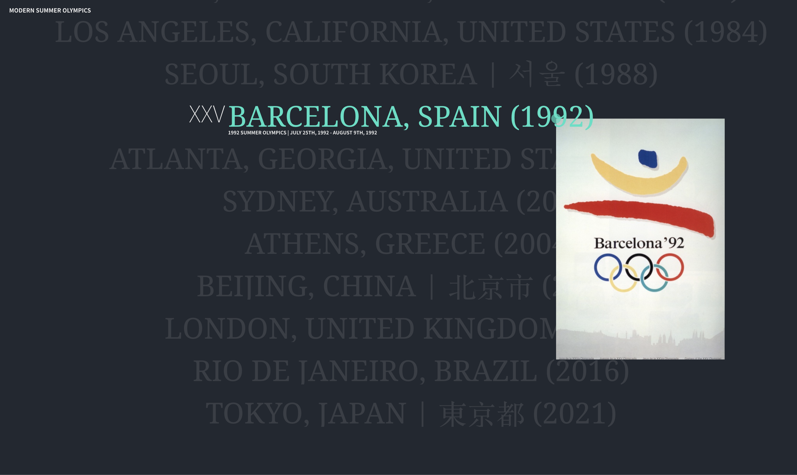

# A Comprehensive List of Modern Summer Olympics



### Description

Menu hover effect about the Modern Summer Olympics done in Javascript.
Dependencies used: parcel-bundler, sass, gsap, imagesloaded, locomotive-scroll

### Instructions

In order to run the app, use the terminal until you locate the folder and run the following command:

```
npm run dev
```
